# -os-lab-quantum-IDTB110144
# os-lab-quantum-IDTB110144

# Level 2: Audit Trails - Add logging capabilities to buy_widget to track successful transactions.

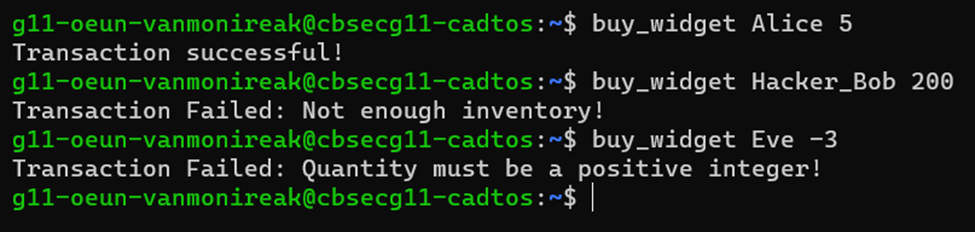
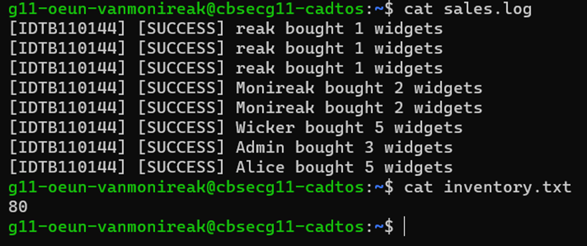

# Level 3: The Exploit (TOC-TOU) - Create the bot_swarm script to simulate a concurrent attack and document the resulting race condition.
Run 1 final inventory: 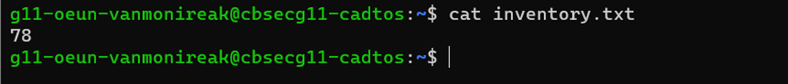
Run 2 final inventory: 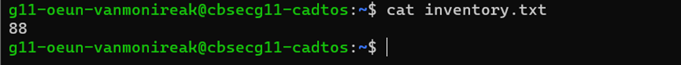
Run 3 final inventory: 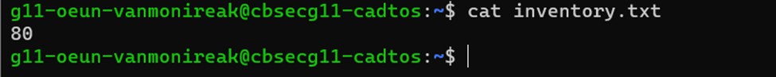
Run 4 final inventory: 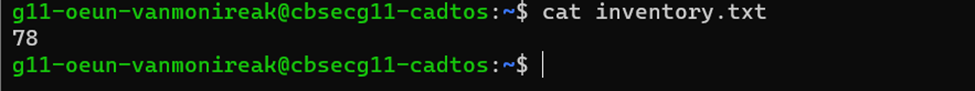
Run 5 final inventory: 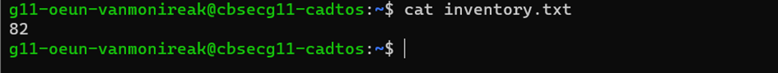

Explanation:
The inventory changes every run because multiple bot processes access inventory.txt simultaneously.
Several processes read the same inventory value before others update it, causing incorrect calculations.
This race condition is known as a Time-of-Check to Time-of-Use (TOC-TOU) vulnerability caused by OS scheduling.

# Level 4: The Patch (Mutex) - Secure the buy_widget script using OS-level file locking (flock) to prevent the exploit.
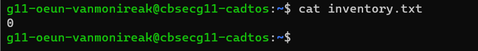
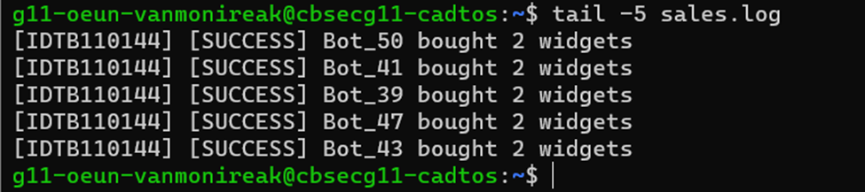

# Level 5: Red Team vs. Blue Team - Pair up with a classmate, configure cross-user permissions, and test your mutex against their bot swarm.
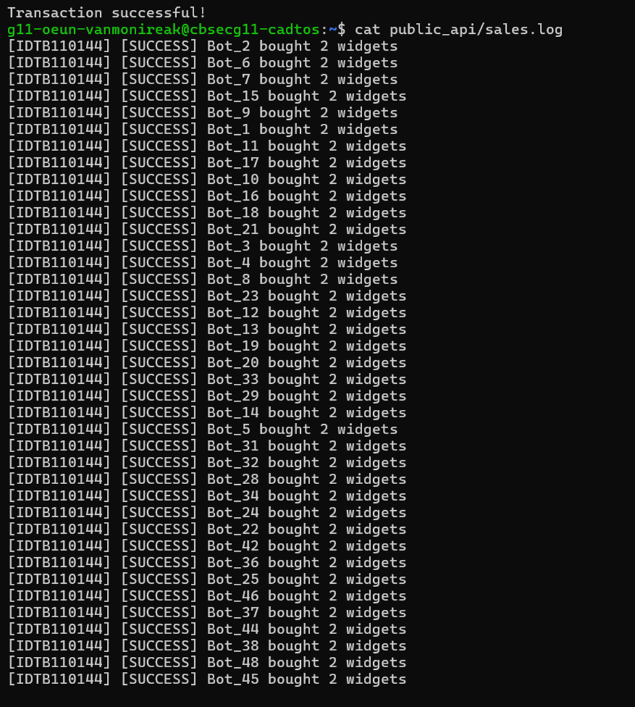
# Level 6: Secure Drop Zone (PoLP) - Build the dropzone script to provision a secure folder where classmates can upload files but cannot delete yours.
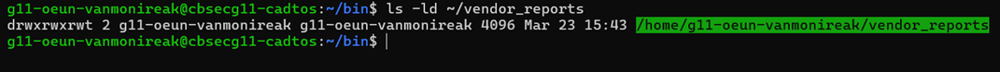

# Level 7: Forensic Cleanup - Build the cleanup script to automatically organize generated log and dump files by their extension.
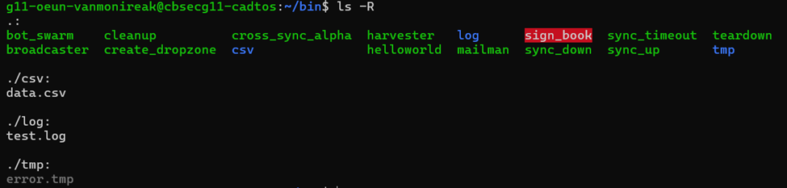